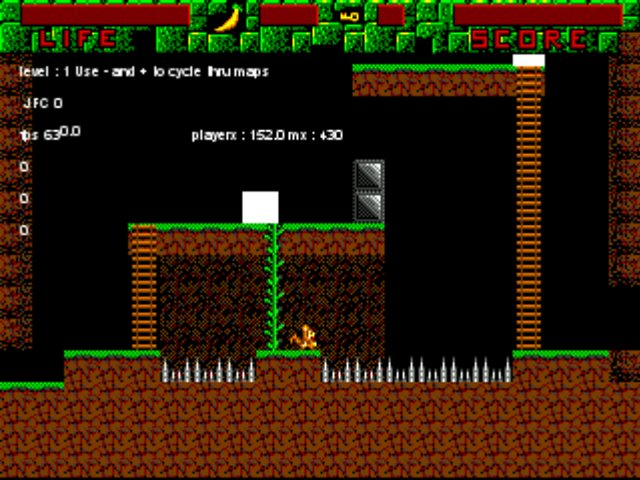
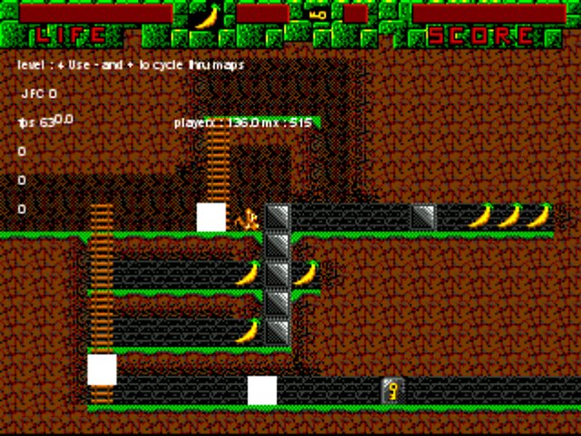
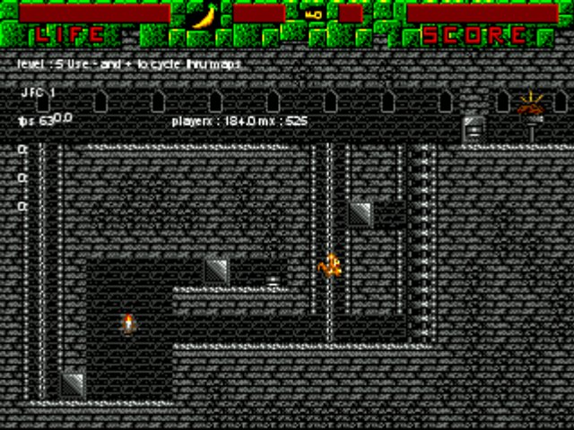

Old game project. Worked on 20 years ago! 

There is a executable in there that requires a Directplay installation. This Windows will handle automatically.  

The code needs cleaning up. It was to hard for me back than. I was not able to solve some bugs.  

The gfx was made by I think it was 'Scott' (I forgot his last name). He wanted to market the game when it was finished.  

The music in the folder is by me.  

 
 

 

 
